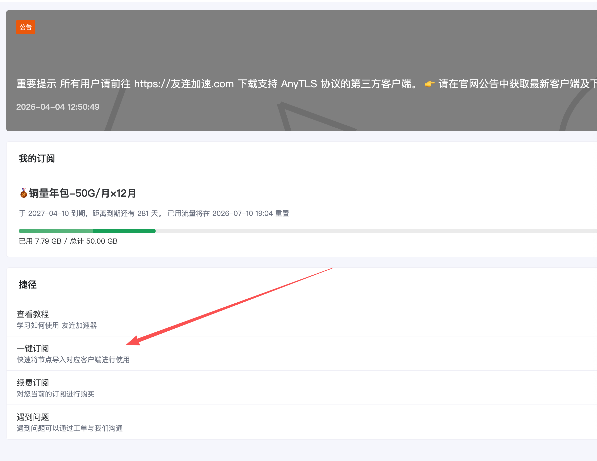
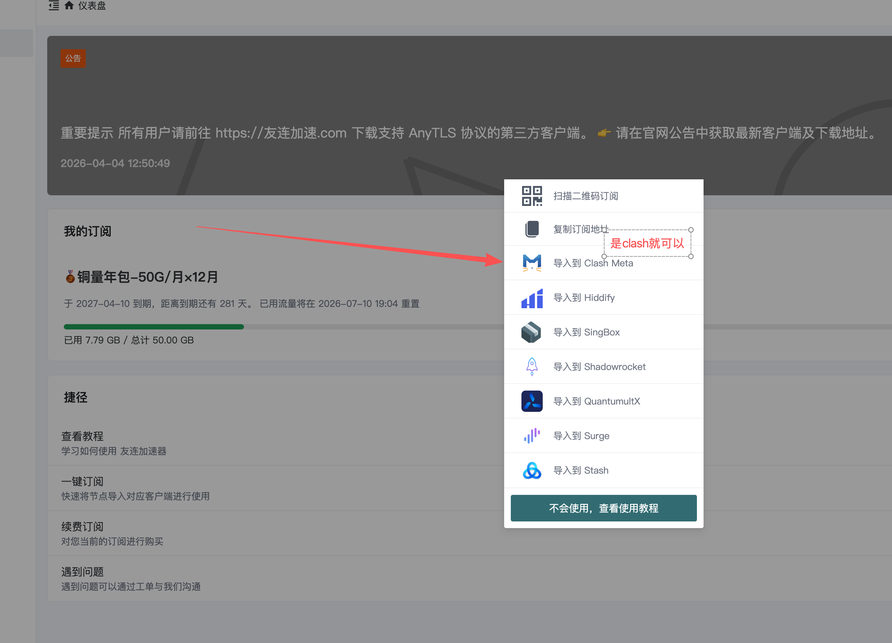

# Codex 安装指南 🚀

一步到位配置 Codex 的安装说明与辅助资源，适合在 Windows 电脑客户端上快速完成环境准备。

## 准备工作 🧰

- 一台 Windows 电脑
- 可用的网络节点账号
- 推荐代理工具：[Clash Verge Rev](https://github.com/clash-verge-rev/clash-verge-rev/releases/download/v2.5.1/Clash.Verge_2.5.1_x64-setup.exe)

## 快速开始 ⚡

1. 下载并安装 Clash Verge Rev。

   点击上方链接下载安装包，按提示完成安装。

2. 打开友连控制台。

   访问：[友连 Dashboard](https://a.youlian41.com/#/dashboard)

3. 导入节点配置。

   按页面提示复制或导入订阅节点。可以参考下面两张截图：

   

   

4. 打开 Codex 页面。

   访问：[OpenAI Codex](https://openai.com/zh-Hans-CN/codex/)

## 小提示 💡

- 如果 Codex 页面无法正常打开，先确认 Clash Verge Rev 已启动并成功连接节点。
- 如果节点无法导入，检查友连控制台中的订阅地址是否复制完整。
- 建议安装完成后保留本 README，后续换电脑或重新配置时可以直接照着操作。
